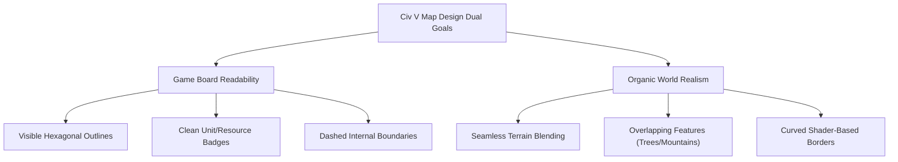

# Technical Analysis - Civilization V Map Rendering Architecture

This document provides a comprehensive analysis of the artwork, architecture, and programming strategies employed by Firaxis Games to build the map system of *Sid Meier's Civilization V* (2010).

---

## 1. Graphic Design & Art Style Philosophy

Civilization V's aesthetic is characterized by a unique fusion of **Art Deco UI details** and a **semi-realistic, painterly, oil-wash landscape**. The developers aimed to create a map that felt like a "living world" and a physical "game board" simultaneously.



### The Visual Goals:
1. **Board Readability**: Players must instantly recognize cell boundaries, biome types, terrain height (flat vs. hill vs. mountain), resources, and territory owners.
2. **Painterly Realism**: The map should avoid clinical, checkerboard lines. Forests should look like organic clusters, coastlines should have soft lapping waves, and mountains should look like rocky ranges rising up naturally from the plains.

---

## 2. Grid Architecture: Logic vs. World Coordinates

One of the fundamental engineering strategies in Civ V is the strict decoupling of the **game logic representation** (discrete grid plots) and the **3D visual representation** (continuous world space).

| Characteristic | Plot Coordinates (Logic) | World Space Coordinates (Graphics) |
| :--- | :--- | :--- |
| **Geometry** | Discrete hexagonal grid indices `(q, r)` | Continuous 3D vector coordinates `(x, y, z)` |
| **Grid Alignment** | Strict hex cell boundaries | Free-form positioning (offsets, jitter, overlapping) |
| **Cylindrical Wrap** | Modular index wrap-around: `q_wrapped = q % width` | Continuous geometric translations on rendering |
| **Features** | Stored as discrete types (e.g., `Biome: Grassland`, `Feature: Forest`) | Rendered as dynamic models/sprites with organic noise offsets |

By separating these systems, Firaxis allowed visual features (like trees, river paths, and mountain peaks) to bend, shift, and overlap cell lines, while the game logic remained perfectly predictable.

---

## 3. Terrain Mesh Generation & Hardware Tessellation

Civ V was one of the first strategy games to natively target **DirectX 11 (DX11)**, which introduced **Hardware Tessellation**. This feature was crucial to achieving organic terrain profiles.

```
[Low-Spec CPU Grid Data] ---> [GPU Hull Shader (Tessellation Factors)]
                                      |
                                      v
[GPU Domain Shader (Displacement Map)] ---> [High-Poly Smooth Terrain Mesh]
```

### Tessellation Pipeline:
- **Low-Resolution Base Mesh**: The CPU sends a relatively low-polygon grid of hexagons to the GPU to keep the vertex buffer overhead small.
- **Dynamic Level of Detail (LOD)**: The GPU's **Hull Shader** dynamically calculates tessellation factors based on the camera distance. Zooming in increases subdivision, while zooming out decreases it.
- **Displacement Mapping**: The **Domain Shader** applies a displacement map (heightmap noise) to the subdivided vertices. This smooths out coastlines, rounds the tops of hills, and adds craggy, non-linear detail to cliffs and mountains on the fly.
- **Mesh Stitching**: To prevent gaps between adjacent cells of differing heights, the engine dynamically adjusts the boundary vertices of neighboring hexes to ensure they align perfectly, forming a single continuous landmass mesh.

---

## 4. Seamless Terrain Blending & Texture Splatting

To eliminate the "screen-door" look of repeating tile grids, the engine uses sophisticated texture splatting and stochastic blending shaders.

### Stochastic Texture Blending:
- **Transition Libraries**: Firaxis built a large library of transition textures (e.g., grassland-to-plains, desert-to-coast).
- **Alpha Mask Blending**: Each hex vertex holds blend weights (alpha values). The pixel shader samples multiple textures (e.g., grassland and plains) and blends them using a noise-perturbed alpha mask.
- **Hiding Tiling Artifacts**: The shader applies minor randomized rotations, scales, and offsets to the texture coordinates based on the hex center, breaking up obvious grid patterns.
- **LayerOrder System**: The engine defines XML-based priorities (`LayerOrder`) specifying which biome blends on top of another. For example, desert textures are splatted over grassland, and coastlines have a high priority to draw soft sand transitions over the water boundaries.

---

## 5. Overlay Feature Placement (Forests, Mountains, Cities)

Instead of clipping features directly to the hex cells, the engine places 3D models or layered billboard sprites on top of the terrain mesh, allowing them to spill across boundary lines.

```
       ▲  [Mountain Peak Overlaps Grid]
     /   \
----+----+---- [Subtle Hex Crease Grid Line]
   /       \
  [Soft Base Terrain Background]
```

### Key Strategies:
- **Poisson Disc Distribution**: To avoid rigid grid patterns in forests, tree trunks are positioned using a Poisson disc distribution. This places trees close together without overlapping trunks, creating a natural forest cluster look.
- **Vertical Displacement**: Mountains are rendered as tall 3D assets that are offset vertically upward. The peak rises above the hex boundaries, casting shadows on adjacent northern tiles.
- **Edge Overflow**: Tree branches, outposts, and buildings are scaled to be slightly larger than the hex boundaries. Their silhouettes overlap the cell lines, masking the underlying grid structure.
- **Ground Shadows**: All overlay assets cast soft, semi-transparent ground shadows. This visual cue tells the player's brain that the features are physically resting on the board, adding depth and realism.

---

## 6. Edge Features: Rivers and Faction Borders

Rivers and borders represent linear graphics that run *along the edges* between cells rather than within them.

```
       ( Vertex A )
          /   \
         /     \  [Border / River Segment]
        /       \
   (Hex 1)     (Hex 2)
        \       /
         \     /
          \   /
       ( Vertex B )
```

### River Routing & Gravity Descent:
- **Adjacency Logic**: Rivers are stored logically as flags on the shared edges between adjacent hexes.
- **Bezier Interpolation**: Rather than drawing straight lines between hex vertices, the engine interpolates a smooth Bezier spline between the vertex points. This gives the rivers natural curves and bends.
- **Elevation Flow pathfinding**: Rivers originate at high-elevation seeds (mountains or hills) and run procedurally along hex edges. Pathfinding seeking the path of least resistance (lowest cost elevation descent) routes the river segments to the nearest ocean or lake.
- **Coastline Outflow**: When a river meets a sea tile, the river mesh expands dynamically and blends its color with the shallow water coastline shader, simulating an estuary.

### Border Shader:
- **Continuous Ribbon Generation**: The engine dynamically constructs a continuous strip (ribbon mesh) along the outer boundary of a player's territory.
- **Dynamic Tube Glow**: The border shader applies a glowing, translucent color fill that moves slightly (using UV panning) to simulate a flowing, active border.
- **Terrain Conformation**: The border mesh conforms exactly to the tessellated height of the terrain beneath it, casting a soft shadow on the ground to look like a physical boundary wire.

---

## 7. Coastline Foam & Water Shaders

Water rendering in Civ V goes beyond flat overlays to simulate real-time hydrodynamics at the boundaries.

- **Depth-Buffer Comparison (Chroma Coastlines)**: The water shader compares the depth values of the terrain mesh submerged beneath the water plane with the water plane itself. Near the shoreline, where the depth difference is very small, the shader blends a lighter, translucent teal color, simulating shallow water. In deeper areas, it transitions to a dark navy blue.
- **Procedural Foam Decals**: The shoreline depth mask dynamically triggers a foam texture shader. This overlays animated white foam lines that wave back and forth along the contours of the land, masking the hard intersection between the land mesh and the water plane.

---

## 8. Squad Rendering and Jittering (1UPT Visuals)

Although Civ V implements a strict **One Unit Per Tile (1UPT)** logic rule, the graphic engine renders military divisions as a squad of multiple individual units (e.g. 10 swordsmen or 4 tanks).

- **Coordinate Jittering**: To prevent units from looking like a uniform grid of toy soldiers, the engine applies random coordinate offsets (jitter) to the placement of each individual model in a squad. This spreads the figures naturally across the terrain's bumps and valleys.
- **Dynamic Orientation**: Individual units rotate slightly towards random focus vectors, preventing them from facing the exact same direction. During idle periods, minor delay offsets are injected into animations so they do not breathe or look around in sync.
- **Terrain Height Adaption**: Raycasts from the squad coordinates probe the tessellated mesh height, placing each individual figure at the exact `Z` height of the ground.

---

## 9. Floating Camera-Facing Billboards (UI Decals)

Resource indicators (wheat, iron, gold icons) and health bars must remain highly visible regardless of the map's zoom level and camera tilt.

- **Billboard Constraints**: These elements are rendered as 2D quads in 3D space but have constraint matrices applied that cancel out camera rotations. They always rotate to face the orthographic/perspective projection vector of the camera.
- **Screen-Space Scaling**: To prevent resource icons from shrinking into invisibility when zoomed out, a shader-based size limit is applied that caps their minimum screen-space scale, ensuring readability at any height.

---

## 10. Render Pipeline Optimization (LORE Architecture)

To render thousands of units, trees, cities, and borders at high frame rates, Firaxis designed the **Low Overhead Rendering Engine (LORE)**, focusing on reducing API state changes and CPU draw call overhead.

### Optimization Strategies:
1. **Stateless, Packetized Rendering**: LORE treats rendering commands as self-contained "packets." The CPU prepares these packets in parallel across multiple threads and pushes them directly to the GPU command buffer, bypassing expensive state changes.
2. **Firaxis Shading Language (FSL)**: FSL compiled down to highly optimized HLSL. It grouped shader constant buffers logically (e.g., separating global camera matrix variables from per-unit animation data), allowing the engine to update only what changed between frames.
3. **Instanced Rendering**: Identical assets, such as trees in a forest or buildings in a city, are submitted in a single instanced draw call. The shader applies individual rotation and scale variations dynamically on the GPU.
4. **Decoupled Fog of War**: The fog of war is calculated on a low-resolution grid and written to a dynamic texture. The terrain shader samples this texture, applying a smooth linear interpolation to blur the boundary between explored, visible, and hidden regions.
